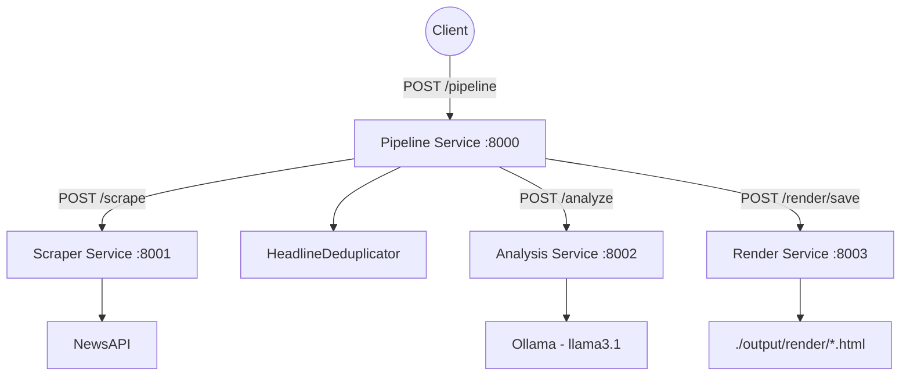

<!-- Improved compatibility of back to top link: See: https://github.com/othneildrew/Best-README-Template/pull/73 -->
<a id="readme-top"></a>

<!-- PROJECT SHIELDS -->
[![Contributors][contributors-shield]][contributors-url]
[![Forks][forks-shield]][forks-url]
[![Stargazers][stars-shield]][stars-url]
[![Issues][issues-shield]][issues-url]
[![Unlicense License][license-shield]][license-url]
[![LinkedIn][linkedin-shield]][linkedin-url]

<!-- PROJECT LOGO -->
<br />
<div align="center">
  <a href="https://github.com/leonifrazao/Parallax">
    
  </a>

  <h3 align="center">Parallax</h3>

  <p align="center">
    An open-source geopolitical intelligence pipeline that scrapes global news, eliminates duplicate coverage, and leverages local LLMs to dissect narrative bias, emotional framing, and hidden motives — delivering structured intelligence reports analysts can act on.
    <br />
    <a href="https://github.com/leonifrazao/Parallax"><strong>Explore the docs »</strong></a>
    <br />
    <br />
    <a href="https://github.com/leonifrazao/Parallax">View Demo</a>
    &middot;
    <a href="https://github.com/leonifrazao/Parallax/issues/new?labels=bug&template=bug-report---.md">Report Bug</a>
    &middot;
    <a href="https://github.com/leonifrazao/Parallax/issues/new?labels=enhancement&template=feature-request---.md">Request Feature</a>
  </p>
</div>

<!-- TABLE OF CONTENTS -->
<details>
  <summary>Table of Contents</summary>
  <ol>
    <li>
      <a href="#about-the-project">About The Project</a>
      <ul>
        <li><a href="#why-parallax">Why "Parallax"?</a></li>
        <li><a href="#key-capabilities">Key Capabilities</a></li>
        <li><a href="#built-with">Built With</a></li>
        <li><a href="#architecture-overview">Architecture Overview</a></li>
        <li><a href="#project-structure">Project Structure</a></li>
      </ul>
    </li>
    <li>
      <a href="#the-intelligence-pipeline">The Intelligence Pipeline</a>
      <ul>
        <li><a href="#1-collection--scraping">Collection & Scraping</a></li>
        <li><a href="#2-deduplication">Deduplication</a></li>
        <li><a href="#3-narrative-analysis">Narrative Analysis</a></li>
        <li><a href="#4-report-rendering">Report Rendering</a></li>
        <li><a href="#5-data-export">Data Export</a></li>
      </ul>
    </li>
    <li>
      <a href="#getting-started">Getting Started</a>
      <ul>
        <li><a href="#prerequisites">Prerequisites</a></li>
        <li><a href="#installation">Installation</a></li>
      </ul>
    </li>
    <li>
      <a href="#usage--api-reference">Usage & API Reference</a>
      <ul>
        <li><a href="#running-an-analysis">Running an Analysis</a></li>
        <li><a href="#request-parameters">Request Parameters</a></li>
        <li><a href="#intelligence-output">Intelligence Output</a></li>
        <li><a href="#individual-service-endpoints">Individual Service Endpoints</a></li>
        <li><a href="#cli-mode">CLI Mode</a></li>
        <li><a href="#interactive-docs--health-checks">Interactive Docs & Health Checks</a></li>
      </ul>
    </li>
    <li><a href="#data-models">Data Models</a></li>
    <li><a href="#roadmap">Roadmap</a></li>
    <li><a href="#contributing">Contributing</a></li>
    <li><a href="#license">License</a></li>
    <li><a href="#contact">Contact</a></li>
    <li><a href="#acknowledgments">Acknowledgments</a></li>
  </ol>
</details>

---

<!-- ABOUT THE PROJECT -->
## About The Project

In any geopolitical crisis, the same event is reported by dozens of outlets — each with its own framing, bias, and agenda. **How** a story is told matters as much as **what** happened. Understanding who frames a conflict as "liberation" vs. "invasion", who amplifies fear vs. neutrality, and which entities are consistently centered in narratives — that's the difference between consuming news and producing intelligence.

**Parallax** is an automated geopolitical narrative intelligence system. It scrapes global news coverage, strips away duplicate reporting, and feeds unique headlines into a local LLM acting as a **senior intelligence analyst specialized in geopolitical narrative analysis**. The output isn't just a summary — it's a structured breakdown of stance, emotional framing, intensity, key actors, narrative motives, and ideological alignment for each piece of coverage.

Everything runs **100% locally**. No cloud APIs for analysis, no data leaving your machine. Ollama runs models like `llama3.1` on your own hardware, ensuring complete operational privacy.

<p align="right">(<a href="#readme-top">back to top</a>)</p>

### Why "Parallax"?

In optics, **parallax** is the apparent displacement of an object when viewed from two different positions. The object hasn't moved — only the observer's angle changed.

News works the same way. The same geopolitical event — a military strike, a trade sanction, a diplomatic summit — looks completely different depending on which outlet, nation, or ideology is reporting it. Parallax reveals those shifts. It doesn't tell you what happened; it tells you **how every observer chose to frame what happened**.

<p align="right">(<a href="#readme-top">back to top</a>)</p>

### Key Capabilities

| Capability | Description |
|---|---|
| 🌐 **Global News Collection** | Scrapes articles from international outlets via NewsAPI. Filter by specific sources (e.g., Al Jazeera, BBC, Reuters) or cast a wide net across all available publishers. |
| 🧹 **Cross-Outlet Deduplication** | Uses RapidFuzz fuzzy matching (`token_set_ratio`, 84% threshold) to eliminate duplicate coverage of the same event across different media, keeping the most complete version. |
| 🧠 **Narrative Dissection** | A local LLM (Ollama) acts as a senior geopolitical analyst, extracting **stance** (e.g., `pro_iran`, `anti_nato`, `neutral`), **emotional tone** (`alarmist`, `factual`, `sympathetic`, `triumphalist`, `defeatist`), **emotional intensity**, **key entities**, **narrative summary**, and **underlying motives** from each article. |
| 📊 **Stance & Bias Mapping** | Stances follow a constrained `neutral / pro_<actor> / anti_<actor>` schema — enabling systematic comparison of how different outlets align on the same conflict. |
| 🎨 **Intelligence Reports** | Auto-generates dark-themed HTML reports with cards per article: stance badges, intensity bars, entity tags, motive pills, and source links. Open them in any browser. |
| 📁 **Multi-Format Export** | Export analysis results to JSON, CSV, or XML for further processing in your own tools or databases. |
| 🏗️ **Microservice Architecture** | Four independent FastAPI services (Pipeline, Scraper, Analysis, Render) orchestrated via Docker Compose. Each can be scaled, replaced, or tested independently. |
| 🔒 **Fully Local & Private** | No data leaves your machine. Ollama runs LLM inference locally. Perfect for sensitive geopolitical research. |
| 💻 **CLI Mode** | Standalone terminal application with formatted Rich tables for quick analysis without a browser. |

<p align="right">(<a href="#readme-top">back to top</a>)</p>

### Built With

* [![Python][Python.org]][Python-url] Python >= 3.12
* [![FastAPI][FastAPI.tiangolo]][FastAPI-url] FastAPI (async REST framework)
* [![Docker][Docker.com]][Docker-url] Docker & Docker Compose
* [![Ollama][Ollama.com]][Ollama-url] Ollama (local LLM inference)
* **UV** — Ultra-fast Python package installer and resolver ([astral-sh/uv](https://github.com/astral-sh/uv))
* **RapidFuzz** — High-performance fuzzy string matching for deduplication
* **Pydantic v2** — Data validation and LLM output schema enforcement
* **dependency-injector** — IoC container for clean architecture
* **HTTPX** — Async HTTP client for inter-service communication
* **Loguru** — Structured logging across all services
* **Rich** — Beautiful terminal output for CLI mode
* **BeautifulSoup4** — HTML parsing for article content extraction
* **Dacite** — Dataclass deserialization utilities

<p align="right">(<a href="#readme-top">back to top</a>)</p>

### Architecture Overview

Parallax divides its intelligence pipeline across **four orchestrated microservices** deployed via Docker Compose. They communicate internally over a Docker network via async REST calls while exposing endpoints externally for direct testing.



**Service Breakdown:**

| Service | Container | External Port | Role |
|---|---|---|---|
| **Pipeline** | `pipeline_service` | `8000` | Orchestrates the full intelligence cycle. Validates queries, coordinates all services, deduplicates headlines, triggers exports. Single entry point for clients. |
| **Scraper** | `scraper_service` | `8001` | Interfaces with news providers (NewsAPI). Fetches articles, parses them into `Headline` models, filters by query relevance and source outlet. |
| **Analysis** | `analysis_service` | `8002` | The intelligence core. Builds geopolitical analysis prompts, dispatches to Ollama, parses structured LLM output into `Narrative` models with stance, tone, entities, and motives. |
| **Render** | `render_service` | `8003` | Transforms `Narrative` data into dark-themed HTML intelligence reports. Writes timestamped `.html` files to a mounted Docker volume (`./output/render`). |

<p align="right">(<a href="#readme-top">back to top</a>)</p>

### Project Structure

```
Parallax/
├── docker-compose.yml                  # Orchestrates all 4 microservices
├── Dockerfile                          # Shared build (Python 3.12-slim + UV)
├── pyproject.toml                      # Project metadata & dependencies
├── uv.lock                            # Deterministic dependency lock
├── .env                                # NEWSAPI_KEY, OLLAMA_HOST
│
├── src/parallax/
│   ├── main.py                         # CLI entry point (standalone mode)
│   ├── container.py                    # Root DI container (CLI mode)
│   │
│   ├── models/
│   │   └── enter/
│   │       ├── headline.py             # Headline: scraped article data
│   │       ├── narrative.py            # Narrative: analyzed intelligence output
│   │       ├── narrativeLLM.py         # LLM schema (constrained stance, tone literals)
│   │       └── web/
│   │           ├── pipelinerequest.py   # Pipeline API request body
│   │           ├── scraperequest.py     # Scraper API request body
│   │           └── renderrequest.py     # Render API request body
│   │
│   ├── interfaces/                     # Abstract contracts (Clean Architecture)
│   │   ├── enter/
│   │   │   ├── IScraper.py             # Scraper provider interface
│   │   │   ├── IWebScraper.py          # Scraper orchestrator interface
│   │   │   ├── INarrativeAnalysis.py   # Analysis engine interface
│   │   │   ├── IAnalysisMetrics.py     # Aggregate metrics interface
│   │   │   └── usecases/
│   │   │       ├── IExecutorUseCase.py # Pipeline executor contract
│   │   │       ├── IScraperUseCase.py  # Scraper use case contract
│   │   │       ├── IAnalysisUseCase.py # Analysis use case contract
│   │   │       └── IRenderUseCase.py   # Render use case contract
│   │   └── out/
│   │       └── ICliApp.py              # CLI output interface
│   │
│   ├── scrapers/
│   │   ├── web.py                      # WebScraper: aggregates all providers
│   │   ├── telegram.py                 # Telegram scraper (planned)
│   │   └── websites/
│   │       ├── base.py                 # BaseScraper: fetcher/parser pattern
│   │       └── newsapi.py              # NewsAPI: get_everything + query filter
│   │
│   ├── analysis/
│   │   ├── engine.py                   # NarrativeAnalysis: prompt → Ollama → Narrative
│   │   └── metrics.py                  # AnalysisMetrics: stance/tone distributions
│   │
│   ├── helpers/
│   │   ├── deduplicator.py             # HeadlineDeduplicator (RapidFuzz)
│   │   └── modeltofile.py             # ModelToFile: export JSON / CSV / XML
│   │
│   ├── ui/
│   │   ├── app.py                      # CliApp: Rich table display
│   │   └── components.py              # UI components (planned)
│   │
│   ├── database/                       # Persistence layer (planned)
│   │   ├── entities.py
│   │   └── repository.py
│   │
│   └── services/                       # Microservice layer
│       ├── pipeline_service/
│       │   ├── container.py            # DI: wires clients → executor
│       │   └── app/
│       │       ├── main.py             # FastAPI app
│       │       ├── controllers/
│       │       │   └── pipeline_controller.py
│       │       ├── clients/
│       │       │   ├── scraper_client.py     # HTTP → Scraper Service
│       │       │   ├── analysis_client.py    # HTTP → Analysis Service
│       │       │   └── render_client.py      # HTTP → Render Service
│       │       └── services/
│       │           └── executor_service.py   # Full pipeline orchestration
│       │
│       ├── scraper_service/
│       │   ├── container.py
│       │   └── app/ (main, controllers, services)
│       │
│       ├── analysis_service/
│       │   ├── container.py
│       │   └── app/ (main, controllers, services)
│       │
│       └── render_service/
│           ├── container.py
│           └── app/
│               └── services/
│                   └── render_service.py   # HTML generation engine
│
└── output/
    └── render/                         # Generated HTML intelligence reports
```

<p align="right">(<a href="#readme-top">back to top</a>)</p>

---

## The Intelligence Pipeline

A single `POST /pipeline` call triggers the entire intelligence cycle. Here's what Parallax does behind the scenes:

### 1. Collection & Scraping

The **Scraper Service** acts as your collection unit, interfacing with news providers to gather raw coverage:

- Queries [NewsAPI](https://newsapi.org/) via `get_everything()` — supports boolean operators (`AND`, `OR`), language filtering (defaults to English), relevancy sorting, and batch sizes up to 20.
- **Source targeting**: Focus your analysis on specific outlets. For geopolitical work, this means you can compare how `al-jazeera-english` vs. `bbc-news` vs. `reuters` frame the same event.
- Parses each raw article into a `Headline` domain model: title, source, URL, description, author, publication date, and a UUID for tracking through the pipeline.
- Applies a secondary local query filter to ensure all returned articles genuinely contain the search term in their headline or description.
- Discards noise: removed articles, missing titles/URLs, empty descriptions.

The scraper architecture is **extensible** — `WebScraper` aggregates results from any number of `IScraper` implementations. A `telegram.py` module is stubbed for future Telegram channel collection.

### 2. Deduplication

In geopolitical events, the same wire story (AP, Reuters) gets republished by dozens of outlets with minimal changes. Analyzing the same event 15 times would waste LLM compute and pollute your intelligence product.

The `HeadlineDeduplicator` solves this:

- Combines `headline + description` into a single comparison string per article.
- Normalizes text: lowercase, strip special characters, collapse whitespace, unify quote characters.
- Compares each candidate against accepted articles using `fuzz.token_set_ratio` — a fuzzy matching algorithm that's resilient to word reordering (critical for news headlines).
- **Threshold: 84%** similarity → flagged as duplicate. The version with more complete text (longer `text + description`) survives.
- Output: a pruned, unique set of perspectives — each representing a genuinely different take on the event.

### 3. Narrative Analysis

This is the core of Parallax. The **Analysis Service** operates the LLM as a geopolitical intelligence analyst.

The system prompt positions Ollama as:

> *"You are a senior intelligence analyst specialized in geopolitical narrative analysis."*

For each batch of deduplicated headlines, the engine:

1. Builds a structured JSON payload with headline IDs, titles, descriptions, and sources.
2. Sends it to Ollama (default model: `llama3.1`) with `temperature: 0` for deterministic, reproducible analysis.
3. Uses **structured output** — the LLM is forced to return JSON conforming to a Pydantic schema (`NarrativeListResponse`), eliminating hallucinated formats.

**What the analyst extracts per headline:**

| Field | Type | Geopolitical Purpose |
|---|---|---|
| `stance` | `neutral`, `pro_<actor>`, `anti_<actor>` | Maps ideological alignment. Pattern: `pro_iran`, `anti_nato`, `pro_ukraine`, etc. Regex-validated to enforce consistency. |
| `emotional_tone` | `alarmist` · `factual` · `sympathetic` · `triumphalist` · `defeatist` | Classifies the emotional framing strategy. Is coverage designed to provoke fear? Generate sympathy? Project strength? |
| `emotional_intensity` | `0.0 – 10.0` | Quantifies how charged the coverage is. Factual wire reports cluster near 1–3; sensationalist coverage spikes to 7–10. |
| `key_entities` | `list[str]` | People, organizations, nations, and concepts that the narrative centers around. Reveals who each outlet considers the primary actor. |
| `narrative_summary` | `str` | Concise distillation of the story being told — not the event, but the *framing* of the event. |
| `motives` | `list[str]` | Underlying agendas detected: "Economic Pressure", "Territorial Legitimization", "Humanitarian Framing", etc. |

### 4. Report Rendering

The **Render Service** transforms raw intelligence into visual HTML reports:

- **Dark intelligence theme** — `#020617` background, Inter typeface, designed for extended reading.
- Each narrative is a **card** containing:
  - **Headline & Source** — What was said and by whom.
  - **Stance Badge** — Pill-shaped label (e.g., `pro_russia`) for instant visual scanning.
  - **Narrative Summary** — The intelligence analyst's distillation.
  - **Emotional Tone & Intensity** — Text label + visual progress bar showing how charged the coverage is.
  - **Key Entities** — Tag pills showing which actors the outlet centers.
  - **Motives** — Tag pills showing detected underlying agendas.
  - **Source Link** — Direct link to the original article for verification.
- Reports are saved as timestamped `.html` files to `./output/render/` (mounted Docker volume), viewable in any browser.

### 5. Data Export

The `ModelToFile` utility enables downstream processing:

- **JSON** — Pretty-printed, UTF-8 encoded arrays. Ideal for feeding into visualization dashboards or further NLP processing.
- **CSV** — Flat tables with auto-detected headers. Nested fields (entities, motives) are serialized as JSON strings. Ready for spreadsheet analysis.
- **XML** — Structured `<items>/<item>` trees. Useful for OSINT tool integration.

All exports are timestamped and saved to the `output/` directory.

<p align="right">(<a href="#readme-top">back to top</a>)</p>

---

<!-- GETTING STARTED -->
## Getting Started

### Prerequisites

1. **Docker & Docker Compose** — Install [Docker Desktop](https://www.docker.com/products/docker-desktop).
2. **Ollama** — Install [Ollama](https://ollama.com/) on your host machine and pull a model:
   ```sh
   ollama pull llama3.1
   ```
   > For deeper geopolitical analysis, larger models (`llama3.1:70b`, `mixtral`) may produce richer results at the cost of speed.
3. **NewsAPI Key** — Get a free API key at [newsapi.org](https://newsapi.org/).

### Installation

1. **Clone the repository**
   ```sh
   git clone https://github.com/leonifrazao/Parallax.git
   cd Parallax
   ```

2. **Configure environment variables**

   Create a `.env` file in the project root:
   ```env
   NEWSAPI_KEY=your_newsapi_key_here
   OLLAMA_HOST=http://host.docker.internal:11434
   ```
   > `host.docker.internal` allows containers to reach your host's Ollama instance. On Linux, you may need to use `--add-host` or the host's IP.

3. **Build and start all services**
   ```sh
   docker compose up --build
   ```

   Four containers will spin up:
   | Container | URL |
   |---|---|
   | Pipeline (gateway) | `http://localhost:8000` |
   | Scraper | `http://localhost:8001` |
   | Analysis | `http://localhost:8002` |
   | Render | `http://localhost:8003` |

4. **Verify** all services are healthy:
   ```sh
   curl http://localhost:8000/health
   # {"status":"ok","service":"pipeline-service","version":"0.1.0"}
   ```

<p align="right">(<a href="#readme-top">back to top</a>)</p>

---

## Usage & API Reference

### Running an Analysis

Send a single `POST` to trigger the full intelligence cycle — collection, deduplication, narrative analysis, rendering, and export:

**Example: Analyze coverage of Iran's nuclear program across major outlets:**

```sh
curl -X POST http://localhost:8000/pipeline \
  -H 'Content-Type: application/json' \
  -d '{
    "query": "Iran nuclear deal",
    "limit": 5,
    "sources": ["al-jazeera-english", "bbc-news", "reuters", "the-washington-post"],
    "tojson": true
  }'
```

**Example: Compare NATO coverage between Western and non-Western outlets:**

```sh
curl -X POST http://localhost:8000/pipeline \
  -H 'Content-Type: application/json' \
  -d '{
    "query": "NATO expansion",
    "limit": 10,
    "sources": ["bbc-news", "cnn", "al-jazeera-english", "the-hindu"],
    "tojson": true
  }'
```

### Request Parameters

| Parameter | Type | Default | Description |
|---|---|---|---|
| `query` | `string` | *required* | Search query. Supports boolean operators: `"Iran AND sanctions"`, `"NATO OR OTAN"`. |
| `limit` | `integer` | `10` | Maximum headlines to analyze (applied after deduplication). Higher = more comprehensive but slower LLM processing. |
| `sources` | `string[]` | `[]` | Filter by NewsAPI source IDs. Empty = all sources. Use this to compare framing across specific outlets. |
| `tojson` | `boolean` | `false` | Also export results as `.json` to the `output/` directory. |

### Intelligence Output

The API returns a JSON array of `Narrative` objects — one per analyzed headline:

```json
[
  {
    "id": "a1b2c3d4-e5f6-7890-abcd-ef1234567890",
    "headline": "Iran Resumes Uranium Enrichment Amid Stalled Talks",
    "stance": "anti_iran",
    "emotional_tone": "alarmist",
    "emotional_intensity": 7.2,
    "key_entities": ["Iran", "IAEA", "United States", "Uranium Enrichment"],
    "narrative_summary": "Western-aligned framing that positions Iran as the aggressor breaking international norms, while omitting context about sanctions relief failures.",
    "motives": ["Security Threat Amplification", "Diplomatic Pressure", "Nuclear Proliferation Fear"],
    "url": "https://www.bbc.com/news/...",
    "source": "BBC News"
  },
  {
    "id": "f9e8d7c6-b5a4-3210-fedc-ba0987654321",
    "headline": "Iran Exercises Sovereign Right to Nuclear Energy",
    "stance": "pro_iran",
    "emotional_tone": "sympathetic",
    "emotional_intensity": 4.1,
    "key_entities": ["Iran", "NPT", "Sovereignty", "Western Powers"],
    "narrative_summary": "Frames Iran's nuclear program as a legitimate exercise of sovereignty under the NPT, emphasizing Western hypocrisy in selective enforcement.",
    "motives": ["Sovereignty Defense", "Anti-Western Framing", "Historical Grievance"],
    "url": "https://www.aljazeera.com/news/...",
    "source": "Al Jazeera English"
  }
]
```

> **Note:** Alongside the API response, an HTML report is also generated at `./output/render/Iran_nuclear_deal_<timestamp>.html` — ready to open in a browser.

### Individual Service Endpoints

Each microservice can be called directly for custom workflows:

| Service | Endpoint | Method | Body | Purpose |
|---|---|---|---|---|
| Scraper | `localhost:8001/scrape` | POST | `{ "query": "...", "sources": [] }` | Raw article collection only |
| Analysis | `localhost:8002/analyze` | POST | Array of `Headline` objects | Narrative analysis only |
| Render | `localhost:8003/render/save` | POST | `{ "title": "...", "filename": "...", "items": [...] }` | HTML generation only |

### CLI Mode

Parallax includes a standalone CLI for local use without Docker:

```sh
uv run parallax
```

Displays a formatted **Rich** table in the terminal with columns: ID, Headline, Stance, Tone, Intensity, Source, URL.

> Requires `NEWSAPI_KEY` and `OLLAMA_HOST` set via `.env` or shell variables.

### Interactive Docs & Health Checks

FastAPI auto-generates Swagger UI for each service:

| Service | Swagger UI | Health Check |
|---|---|---|
| Pipeline | [`localhost:8000/docs`](http://localhost:8000/docs) | `GET /health` |
| Scraper | [`localhost:8001/docs`](http://localhost:8001/docs) | `GET /health` |
| Analysis | [`localhost:8002/docs`](http://localhost:8002/docs) | `GET /health` |
| Render | [`localhost:8003/docs`](http://localhost:8003/docs) | `GET /health` |

<p align="right">(<a href="#readme-top">back to top</a>)</p>

---

## Data Models

### Headline (Collection Input)

```python
class Headline(BaseModel):
    text: str                          # Article title
    source: str                        # Publisher name (e.g., "BBC News")
    url: str | None                    # Article URL
    description: str | None            # Subtitle / lead paragraph
    author: str | None                 # Author name
    published_at: datetime | None      # Publication timestamp
    scraped_at: datetime               # When Parallax collected it (auto)
    id: str                            # UUID for pipeline tracking (auto)
```

### Narrative (Intelligence Output)

```python
class Narrative(BaseModel):
    id: str                            # Matches original Headline UUID
    headline: str                      # LLM-reformulated headline
    stance: str                        # neutral / pro_<actor> / anti_<actor>
    emotional_tone: str                # alarmist / factual / sympathetic / triumphalist / defeatist
    emotional_intensity: float         # 0.0 – 10.0
    key_entities: list[str]            # People, orgs, nations, concepts
    narrative_summary: str             # Analyst's distillation of the framing
    motives: list[str]                 # Detected underlying agendas
    url: str                           # Original source URL
    source: str                        # Publisher name
```

### NarrativeLLM (LLM Schema Constraints)

The schema sent to Ollama enforces strict typing:
- `stance` is regex-validated: `^(neutral|pro_[a-z0-9_]+|anti_[a-z0-9_]+)$`
- `emotional_tone` is a `Literal` enum (only 5 allowed values)
- `emotional_intensity` is bounded: `0.0 ≤ x ≤ 10.0`

This prevents hallucinated or inconsistent output from the LLM.

<p align="right">(<a href="#readme-top">back to top</a>)</p>

---

<!-- ROADMAP -->
## Roadmap

- [x] NewsAPI collection integration
- [x] RapidFuzz cross-outlet deduplication
- [x] Ollama narrative analysis with structured output
- [x] Geopolitical stance & bias extraction (`pro_*/anti_*` schema)
- [x] Emotional tone classification (5-class taxonomy)
- [x] Automated HTML intelligence report generation
- [x] Source-based outlet filtering
- [x] Multi-format export (JSON, CSV, XML)
- [x] CLI mode with Rich terminal tables
- [x] Dependency Injection architecture
- [x] Docker Compose microservice orchestration
- [x] Health check endpoints
- [ ] Additional collection sources (Telegram channels, Reddit, Twitter/X)
- [ ] Interactive dashboard (Next.js / React) with stance comparison charts
- [ ] Multi-language support (collection & analysis in PT-BR, AR, RU)
- [ ] Database persistence for historical narrative tracking
- [ ] Aggregate metrics dashboard (stance distributions, entity frequency, tone trends over time)
- [ ] Comparative analysis mode (same event, two outlet groups, side-by-side)

See the [open issues](https://github.com/leonifrazao/Parallax/issues) for a full list of proposed features and known issues.

<p align="right">(<a href="#readme-top">back to top</a>)</p>

<!-- CONTRIBUTING -->
## Contributing

Contributions are what make the open source community such an amazing place to learn, inspire, and create. Any contributions you make are **greatly appreciated**.

If you have a suggestion that would make this better, please fork the repo and create a pull request. You can also simply open an issue with the tag "enhancement".
Don't forget to give the project a star! Thanks again!

1. Fork the Project
2. Create your Feature Branch (`git checkout -b feature/AmazingFeature`)
3. Commit your Changes (`git commit -m 'Add some AmazingFeature'`)
4. Push to the Branch (`git push origin feature/AmazingFeature`)
5. Open a Pull Request

<p align="right">(<a href="#readme-top">back to top</a>)</p>

<!-- LICENSE -->
## License

Distributed under the Unlicense License. See `LICENSE.txt` for more information.

<p align="right">(<a href="#readme-top">back to top</a>)</p>

<!-- CONTACT -->
## Contact

Leoni Frazão - leoni.frazao.oliveira@gmail.com

Project Link: [https://github.com/leonifrazao/Parallax](https://github.com/leonifrazao/Parallax)

<p align="right">(<a href="#readme-top">back to top</a>)</p>

<!-- ACKNOWLEDGMENTS -->
## Acknowledgments

* [FastAPI](https://fastapi.tiangolo.com/) — High-performance async web framework
* [Ollama](https://ollama.com/) — Run LLMs locally with full privacy
* [RapidFuzz](https://github.com/maxbachmann/RapidFuzz) — Blazing-fast fuzzy string matching
* [UV](https://github.com/astral-sh/uv) — Ultra-fast Python package manager
* [Loguru](https://github.com/Delgan/loguru) — Effortless structured logging
* [Rich](https://github.com/Textualize/rich) — Beautiful terminal formatting
* [dependency-injector](https://github.com/ets-labs/python-dependency-injector) — IoC containers for Python
* [Pydantic](https://docs.pydantic.dev/) — Data validation using Python type annotations
* [HTTPX](https://www.python-httpx.org/) — Async HTTP client
* [NewsAPI](https://newsapi.org/) — International news data provider

<p align="right">(<a href="#readme-top">back to top</a>)</p>


<!-- MARKDOWN LINKS & IMAGES -->
[contributors-shield]: https://img.shields.io/github/contributors/leonifrazao/Parallax.svg?style=for-the-badge
[contributors-url]: https://github.com/leonifrazao/Parallax/graphs/contributors
[forks-shield]: https://img.shields.io/github/forks/leonifrazao/Parallax.svg?style=for-the-badge
[forks-url]: https://github.com/leonifrazao/Parallax/network/members
[stars-shield]: https://img.shields.io/github/stars/leonifrazao/Parallax.svg?style=for-the-badge
[stars-url]: https://github.com/leonifrazao/Parallax/stargazers
[issues-shield]: https://img.shields.io/github/issues/leonifrazao/Parallax.svg?style=for-the-badge
[issues-url]: https://github.com/leonifrazao/Parallax/issues
[license-shield]: https://img.shields.io/github/license/leonifrazao/Parallax.svg?style=for-the-badge
[license-url]: https://github.com/leonifrazao/Parallax/blob/master/LICENSE.txt
[linkedin-shield]: https://img.shields.io/badge/-LinkedIn-black.svg?style=for-the-badge&logo=linkedin&colorB=555
[linkedin-url]: https://linkedin.com/in/leonifrazao
[product-screenshot]: images/screenshot.png

[Python.org]: https://img.shields.io/badge/Python-3776AB?style=for-the-badge&logo=python&logoColor=white
[Python-url]: https://python.org
[FastAPI.tiangolo]: https://img.shields.io/badge/FastAPI-009688?style=for-the-badge&logo=fastapi&logoColor=white
[FastAPI-url]: https://fastapi.tiangolo.com
[Docker.com]: https://img.shields.io/badge/Docker-2496ED?style=for-the-badge&logo=docker&logoColor=white
[Docker-url]: https://docker.com
[Ollama.com]: https://img.shields.io/badge/Ollama-000000?style=for-the-badge&logo=ollama&logoColor=white
[Ollama-url]: https://ollama.com/
