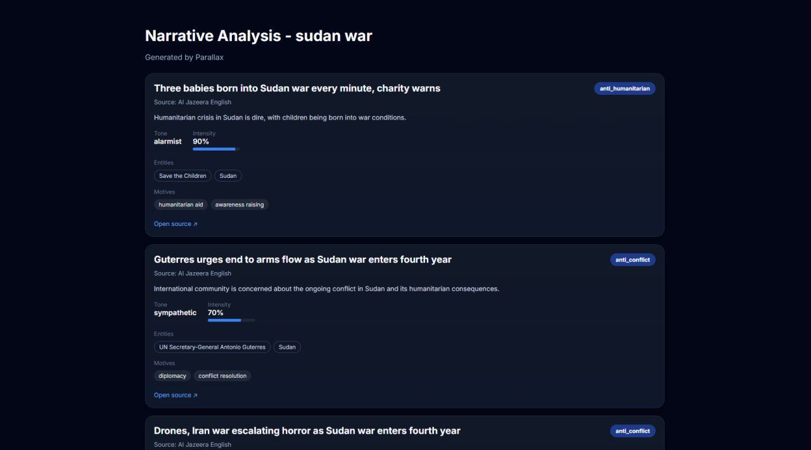

# Parallax

<!-- PROJECT SHIELDS -->
[![Contributors][contributors-shield]][contributors-url]
[![Forks][forks-shield]][forks-url]
[![Stargazers][stars-shield]][stars-url]
[![Issues][issues-shield]][issues-url]
[![Unlicense License][license-shield]][license-url]
[![LinkedIn][linkedin-shield]][linkedin-url]

<br />
<div align="center">
  <a href="https://github.com/leonifrazao/Parallax">
    
  </a>
</div>

---

> *How a story is told matters as much as what happened.*

The same military strike. The same diplomatic summit. The same sanction. Reported by a dozen outlets — each with its own framing, its own agenda, its own version of the truth.

**Parallax** doesn't tell you what happened. It tells you **how every observer chose to frame what happened** — automatically, at scale, with zero cloud dependency.

One `POST /pipeline` call. Scrape → Deduplicate → Analyze → Report.

<br />

<div align="center">
  
  <br/>
  <sub><i>Real output — Sudan war coverage from Al Jazeera English. Three articles, three different detected stances (anti_humanitarian, anti_conflict), emotional intensity ranging from 70% to 90%. Note: even within a single outlet, Parallax detects distinct narrative framings per article — it analyzes content, not just source.</i></sub>
</div>

<br />

---

<!-- TABLE OF CONTENTS -->
<details>
  <summary>Table of Contents</summary>
  <ol>
    <li><a href="#why-parallax">Why "Parallax"?</a></li>
    <li><a href="#key-capabilities">Key Capabilities</a></li>
    <li><a href="#architecture-overview">Architecture Overview</a></li>
    <li><a href="#the-intelligence-pipeline">The Intelligence Pipeline</a></li>
    <li><a href="#getting-started">Getting Started</a></li>
    <li><a href="#usage--api-reference">Usage & API Reference</a></li>
    <li><a href="#data-models">Data Models</a></li>
    <li><a href="#roadmap">Roadmap</a></li>
    <li><a href="#built-with">Built With</a></li>
    <li><a href="#contributing">Contributing</a></li>
    <li><a href="#license">License</a></li>
    <li><a href="#contact">Contact</a></li>
  </ol>
</details>

---

## Why "Parallax"?

In optics, **parallax** is the apparent displacement of an object when viewed from two different positions. The object hasn't moved — only the observer's angle changed.

News works the same way. Parallax reveals those shifts. It doesn't consume news — it **produces intelligence from news**.

Everything runs **100% locally**. No cloud APIs, no data leaving your machine. Ollama runs LLM inference on your own hardware — built for researchers who treat operational privacy as a hard requirement, not a nice-to-have.

<p align="right">(<a href="#readme-top">back to top</a>)</p>

---

## Key Capabilities

| Capability | Description |
|---|---|
| 🌐 **Global News Collection** | Queries international outlets via NewsAPI. Target specific sources (Al Jazeera, BBC, Reuters) or cast wide. Supports boolean operators (`AND`, `OR`), language filters, and batch sizes up to 20. |
| 🧹 **Cross-Outlet Deduplication** | RapidFuzz `token_set_ratio` at 84% threshold eliminates wire stories republished across dozens of outlets. The most complete version survives. Each remaining article represents a genuinely different perspective. |
| 🧠 **Narrative Dissection** | Local LLM (Ollama) acts as a senior geopolitical analyst. Extracts **stance**, **emotional tone**, **intensity**, **key entities**, **narrative summary**, and **underlying motives** per article — via structured Pydantic output, no hallucinated formats. |
| 📊 **Stance & Bias Mapping** | Constrained `neutral / pro_<actor> / anti_<actor>` schema with regex validation. Enables systematic, comparable bias mapping across outlets and over time. |
| 🎨 **Intelligence Reports** | Auto-generated dark-themed HTML reports: stance badges, intensity bars, entity tags, motive pills, source links. Open in any browser, no dependencies. |
| 📁 **Multi-Format Export** | JSON, CSV, XML — for dashboards, NLP pipelines, OSINT tools, or spreadsheet analysis. Timestamped, UTF-8, ready to pipe downstream. |
| 🏗️ **Microservice Architecture** | Four independent FastAPI services (Pipeline, Scraper, Analysis, Render) via Docker Compose. Each independently scalable, replaceable, and testable. |
| 🔒 **Fully Local & Private** | Zero egress. Ollama runs on your hardware. Built for sensitive geopolitical research. |
| 💻 **CLI Mode** | Rich terminal tables for quick analysis without a browser or Docker. |

<p align="right">(<a href="#readme-top">back to top</a>)</p>

---

## Architecture Overview

Four orchestrated microservices. One entry point. Full intelligence cycle.


| Service | Container | Port | Role |
|---|---|---|---|
| **Pipeline** | `pipeline_service` | `8000` | Orchestrates the full cycle. Single entry point. |
| **Scraper** | `scraper_service` | `8001` | NewsAPI integration. Parses into `Headline` models. |
| **Analysis** | `analysis_service` | `8002` | The intelligence core. Prompt → Ollama → structured `Narrative`. |
| **Render** | `render_service` | `8003` | `Narrative` data → dark-themed HTML reports. |

<details>
<summary>Full project structure</summary>

```
Parallax/
├── docker-compose.yml
├── Dockerfile
├── pyproject.toml
├── uv.lock
├── .env                                # NEWSAPI_KEY, OLLAMA_HOST
│
├── src/parallax/
│   ├── main.py                         # CLI entry point
│   ├── container.py                    # Root DI container (CLI mode)
│   │
│   ├── models/enter/
│   │   ├── headline.py
│   │   ├── narrative.py
│   │   ├── narrativeLLM.py             # LLM schema (constrained stance, tone literals)
│   │   └── web/
│   │       ├── pipelinerequest.py
│   │       ├── scraperequest.py
│   │       └── renderrequest.py
│   │
│   ├── interfaces/                     # Abstract contracts (Clean Architecture)
│   │   ├── enter/
│   │   │   ├── IScraper.py
│   │   │   ├── IWebScraper.py
│   │   │   ├── INarrativeAnalysis.py
│   │   │   ├── IAnalysisMetrics.py
│   │   │   └── usecases/
│   │   │       ├── IExecutorUseCase.py
│   │   │       ├── IScraperUseCase.py
│   │   │       ├── IAnalysisUseCase.py
│   │   │       └── IRenderUseCase.py
│   │   └── out/
│   │       └── ICliApp.py
│   │
│   ├── scrapers/
│   │   ├── web.py                      # WebScraper: aggregates all providers
│   │   ├── telegram.py                 # Telegram scraper (planned)
│   │   └── websites/
│   │       ├── base.py
│   │       └── newsapi.py
│   │
│   ├── analysis/
│   │   ├── engine.py                   # prompt → Ollama → Narrative
│   │   └── metrics.py                  # stance/tone distributions
│   │
│   ├── helpers/
│   │   ├── deduplicator.py             # RapidFuzz deduplication
│   │   └── modeltofile.py             # JSON / CSV / XML export
│   │
│   ├── ui/
│   │   └── app.py                      # Rich CLI table
│   │
│   └── services/
│       ├── pipeline_service/
│       ├── scraper_service/
│       ├── analysis_service/
│       └── render_service/
│
└── output/render/                      # Generated HTML reports
```
</details>

<p align="right">(<a href="#readme-top">back to top</a>)</p>

---

## The Intelligence Pipeline

A single `POST /pipeline` triggers the full cycle.

### 1. Collection & Scraping

- Queries NewsAPI via `get_everything()` — boolean operators, language filter, relevancy sort, batches up to 20.
- Source targeting: compare `al-jazeera-english` vs `bbc-news` vs `reuters` on the same event.
- Parses into `Headline` models (title, source, URL, description, author, date, UUID).
- Secondary local filter ensures articles genuinely contain the search term.
- Discards noise: missing titles, empty descriptions, removed articles.
- Extensible: `WebScraper` aggregates any `IScraper` implementation. `telegram.py` stubbed for future Telegram collection.

### 2. Deduplication

The same wire story (AP, Reuters) gets republished by dozens of outlets. Analyzing it 15 times wastes LLM compute and pollutes your intelligence product.

`HeadlineDeduplicator`:
- Combines `headline + description` into a single comparison string.
- Normalizes: lowercase, strip special chars, collapse whitespace, unify quotes.
- `fuzz.token_set_ratio` — resilient to word reordering (critical for news headlines).
- **84% threshold** → flagged as duplicate. Longer version survives.
- Output: a pruned set where each article represents a genuinely distinct perspective.

### 3. Narrative Analysis

The **Analysis Service** operates the LLM as a geopolitical intelligence analyst.

System prompt: *"You are a senior intelligence analyst specialized in geopolitical narrative analysis."*

For each batch of deduplicated headlines:
1. Builds structured JSON payload (IDs, titles, descriptions, sources).
2. Dispatches to Ollama with `temperature: 0` — deterministic, reproducible.
3. **Structured output** via Pydantic (`NarrativeListResponse`) — hallucinated formats are impossible.

**What the analyst extracts:**

| Field | Type | Purpose |
|---|---|---|
| `stance` | `neutral / pro_<actor> / anti_<actor>` | Ideological alignment. Regex-validated. |
| `emotional_tone` | `alarmist · factual · sympathetic · triumphalist · defeatist` | Emotional framing strategy. |
| `emotional_intensity` | `0.0 – 10.0` | Charge level. Wire reports: 1–3. Sensationalist: 7–10. |
| `key_entities` | `list[str]` | Who each outlet centers in the narrative. |
| `narrative_summary` | `str` | The framing of the event — not the event itself. |
| `motives` | `list[str]` | Detected agendas: "Humanitarian Framing", "Territorial Legitimization", etc. |

### 4. Report Rendering

Dark intelligence theme (`#020617`, Inter typeface). Per-article cards: stance badge, narrative summary, tone + intensity bar, entity tags, motive pills, source link. Saved as timestamped `.html` to `./output/render/`.

### 5. Data Export

`ModelToFile` → JSON (pretty-printed), CSV (nested fields as JSON strings), XML (`<items>/<item>`). All timestamped to `output/`.

<p align="right">(<a href="#readme-top">back to top</a>)</p>

---

## Getting Started

### Prerequisites

1. **Docker & Docker Compose** — [Docker Desktop](https://www.docker.com/products/docker-desktop)
2. **Ollama** — [ollama.com](https://ollama.com/), then:
   ```sh
   ollama pull llama3.1
   ```
   > Larger models (`llama3.1:70b`, `mixtral`) produce richer analysis at the cost of speed.
3. **NewsAPI Key** — free at [newsapi.org](https://newsapi.org/)

### Installation

```sh
git clone https://github.com/leonifrazao/Parallax.git
cd Parallax
```

Create `.env`:
```env
NEWSAPI_KEY=your_newsapi_key_here
OLLAMA_HOST=http://host.docker.internal:11434
```
> On Linux, you may need `--add-host` or the host's IP instead of `host.docker.internal`.

```sh
docker compose up --build
```

| Container | URL |
|---|---|
| Pipeline (gateway) | `http://localhost:8000` |
| Scraper | `http://localhost:8001` |
| Analysis | `http://localhost:8002` |
| Render | `http://localhost:8003` |

Verify:
```sh
curl http://localhost:8000/health
# {"status":"ok","service":"pipeline-service","version":"0.1.0"}
```

<p align="right">(<a href="#readme-top">back to top</a>)</p>

---

## Usage & API Reference

### Running an Analysis

```sh
# Compare Iran nuclear coverage across ideologically opposed outlets
curl -X POST http://localhost:8000/pipeline \
  -H 'Content-Type: application/json' \
  -d '{
    "query": "Iran nuclear deal",
    "limit": 5,
    "sources": ["al-jazeera-english", "bbc-news", "reuters", "the-washington-post"],
    "tojson": true
  }'

# Detect NATO framing divergence between Western and non-Western press
curl -X POST http://localhost:8000/pipeline \
  -H 'Content-Type: application/json' \
  -d '{
    "query": "NATO expansion",
    "limit": 10,
    "sources": ["bbc-news", "cnn", "al-jazeera-english", "the-hindu"],
    "tojson": true
  }'
```

### Request Parameters

| Parameter | Type | Default | Description |
|---|---|---|---|
| `query` | `string` | *required* | Supports boolean operators: `"Iran AND sanctions"`, `"NATO OR OTAN"` |
| `limit` | `integer` | `10` | Max headlines after deduplication |
| `sources` | `string[]` | `[]` | NewsAPI source IDs. Empty = all sources |
| `tojson` | `boolean` | `false` | Export `.json` to `output/` |

### Intelligence Output

```json
[
  {
    "id": "a1b2c3d4-e5f6-7890-abcd-ef1234567890",
    "headline": "Iran Resumes Uranium Enrichment Amid Stalled Talks",
    "stance": "anti_iran",
    "emotional_tone": "alarmist",
    "emotional_intensity": 7.2,
    "key_entities": ["Iran", "IAEA", "United States", "Uranium Enrichment"],
    "narrative_summary": "Western-aligned framing positioning Iran as aggressor, omitting context about sanctions relief failures.",
    "motives": ["Security Threat Amplification", "Diplomatic Pressure", "Nuclear Proliferation Fear"],
    "url": "https://www.bbc.com/news/...",
    "source": "BBC News"
  },
  {
    "id": "f9e8d7c6-b5a4-3210-fedc-ba0987654321",
    "headline": "Iran Exercises Sovereign Right to Nuclear Energy",
    "stance": "pro_iran",
    "emotional_tone": "sympathetic",
    "emotional_intensity": 4.1,
    "key_entities": ["Iran", "NPT", "Sovereignty", "Western Powers"],
    "narrative_summary": "Frames Iran's program as legitimate under the NPT, emphasizing Western hypocrisy in selective enforcement.",
    "motives": ["Sovereignty Defense", "Anti-Western Framing", "Historical Grievance"],
    "url": "https://www.aljazeera.com/news/...",
    "source": "Al Jazeera English"
  }
]
```

> An HTML report is also generated at `./output/render/Iran_nuclear_deal_<timestamp>.html`.

### Individual Service Endpoints

| Service | Endpoint | Method | Purpose |
|---|---|---|---|
| Scraper | `localhost:8001/scrape` | POST | Raw collection only |
| Analysis | `localhost:8002/analyze` | POST | Narrative analysis only |
| Render | `localhost:8003/render/save` | POST | HTML generation only |

### CLI Mode

```sh
uv run parallax
```

Rich terminal table: ID, Headline, Stance, Tone, Intensity, Source, URL.

### Swagger UI & Health Checks

| Service | Swagger | Health |
|---|---|---|
| Pipeline | `localhost:8000/docs` | `GET /health` |
| Scraper | `localhost:8001/docs` | `GET /health` |
| Analysis | `localhost:8002/docs` | `GET /health` |
| Render | `localhost:8003/docs` | `GET /health` |

<p align="right">(<a href="#readme-top">back to top</a>)</p>

---

## Data Models

### Headline

```python
class Headline(BaseModel):
    text: str
    source: str
    url: str | None
    description: str | None
    author: str | None
    published_at: datetime | None
    scraped_at: datetime              # auto
    id: str                           # UUID, auto
```

### Narrative

```python
class Narrative(BaseModel):
    id: str                           # matches Headline UUID
    headline: str                     # LLM-reformulated
    stance: str                       # neutral / pro_<actor> / anti_<actor>
    emotional_tone: str               # alarmist / factual / sympathetic / triumphalist / defeatist
    emotional_intensity: float        # 0.0 – 10.0
    key_entities: list[str]
    narrative_summary: str
    motives: list[str]
    url: str
    source: str
```

### Schema Constraints (NarrativeLLM)

- `stance` — regex: `^(neutral|pro_[a-z0-9_]+|anti_[a-z0-9_]+)$`
- `emotional_tone` — `Literal` enum, 5 values only
- `emotional_intensity` — bounded `0.0 ≤ x ≤ 10.0`

Structured output via Pydantic prevents hallucinated or inconsistent LLM responses.

<p align="right">(<a href="#readme-top">back to top</a>)</p>

---

## Roadmap

**Done:**

- [x] NewsAPI collection + source targeting
- [x] RapidFuzz cross-outlet deduplication (84% threshold)
- [x] Ollama narrative analysis with structured Pydantic output
- [x] Stance & bias extraction (`pro_*/anti_*` with regex validation)
- [x] Emotional tone classification (5-class taxonomy)
- [x] HTML intelligence report generation
- [x] Multi-format export (JSON, CSV, XML)
- [x] CLI mode (Rich tables)
- [x] Dependency Injection architecture (IoC containers)
- [x] Docker Compose microservice orchestration
- [x] Health check endpoints

**Next (prioritized by value, not wish list):**

- [ ] **PostgreSQL persistence layer** — without it, every run is ephemeral. Historical narrative tracking (the most strategically valuable use case) is impossible without persistence. This is the highest-leverage next step.
- [ ] **Aggregate metrics dashboard** — once data persists: stance distributions over time, entity frequency shifts, tone trends across crises. This turns Parallax from a one-shot tool into an ongoing intelligence asset.
- [ ] **Comparative analysis mode** — same event, two outlet groups, side-by-side diff. The core use case for researchers.
- [ ] **Additional collection sources** — Telegram channels, Reddit, Twitter/X. Extends coverage beyond NewsAPI's Western-press bias.
- [ ] **Multi-language analysis** — PT-BR, AR, RU. Needed to properly analyze non-English narratives without translation loss.

<p align="right">(<a href="#readme-top">back to top</a>)</p>

---

## Built With

* [![Python][Python.org]][Python-url] Python >= 3.12
* [![FastAPI][FastAPI.tiangolo]][FastAPI-url] FastAPI
* [![Docker][Docker.com]][Docker-url] Docker & Docker Compose
* [![Ollama][Ollama.com]][Ollama-url] Ollama (local LLM inference)
* **UV** — [astral-sh/uv](https://github.com/astral-sh/uv)
* **RapidFuzz** — fuzzy string matching
* **Pydantic v2** — structured LLM output enforcement
* **dependency-injector** — IoC containers
* **HTTPX** — async HTTP client
* **Loguru** — structured logging
* **Rich** — terminal output
* **BeautifulSoup4** — HTML parsing

<p align="right">(<a href="#readme-top">back to top</a>)</p>

---

## Contributing

If something is broken, open an issue. If you have a meaningful addition — new scraper source, improved analysis prompt, dashboard frontend — fork, branch, and open a PR.

Focus areas where contributions are most impactful:
- New `IScraper` implementations (Telegram, Reddit, RSS feeds)
- Improved system prompts for specific conflict domains
- Persistence layer (PostgreSQL + repository pattern already stubbed)

```sh
git checkout -b feature/your-feature
git commit -m 'Add your feature'
git push origin feature/your-feature
# Open a Pull Request
```

<p align="right">(<a href="#readme-top">back to top</a>)</p>

---

## License

Unlicense. See `LICENSE.txt`. Do what you want with it.

---

## Contact

Leoni Frazão — leoni.frazao.oliveira@gmail.com

[github.com/leonifrazao/Parallax](https://github.com/leonifrazao/Parallax) · [linkedin.com/in/leonifrazao](https://linkedin.com/in/leonifrazao)

<p align="right">(<a href="#readme-top">back to top</a>)</p>

---

<!-- MARKDOWN LINKS -->
[contributors-shield]: https://img.shields.io/github/contributors/leonifrazao/Parallax.svg?style=for-the-badge
[contributors-url]: https://github.com/leonifrazao/Parallax/graphs/contributors
[forks-shield]: https://img.shields.io/github/forks/leonifrazao/Parallax.svg?style=for-the-badge
[forks-url]: https://github.com/leonifrazao/Parallax/network/members
[stars-shield]: https://img.shields.io/github/stars/leonifrazao/Parallax.svg?style=for-the-badge
[stars-url]: https://github.com/leonifrazao/Parallax/stargazers
[issues-shield]: https://img.shields.io/github/issues/leonifrazao/Parallax.svg?style=for-the-badge
[issues-url]: https://github.com/leonifrazao/Parallax/issues
[license-shield]: https://img.shields.io/github/license/leonifrazao/Parallax.svg?style=for-the-badge
[license-url]: https://github.com/leonifrazao/Parallax/blob/master/LICENSE.txt
[linkedin-shield]: https://img.shields.io/badge/-LinkedIn-black.svg?style=for-the-badge&logo=linkedin&colorB=555
[linkedin-url]: https://linkedin.com/in/leonifrazao

[Python.org]: https://img.shields.io/badge/Python-3776AB?style=for-the-badge&logo=python&logoColor=white
[Python-url]: https://python.org
[FastAPI.tiangolo]: https://img.shields.io/badge/FastAPI-009688?style=for-the-badge&logo=fastapi&logoColor=white
[FastAPI-url]: https://fastapi.tiangolo.com
[Docker.com]: https://img.shields.io/badge/Docker-2496ED?style=for-the-badge&logo=docker&logoColor=white
[Docker-url]: https://docker.com
[Ollama.com]: https://img.shields.io/badge/Ollama-000000?style=for-the-badge&logo=ollama&logoColor=white
[Ollama-url]: https://ollama.com/
